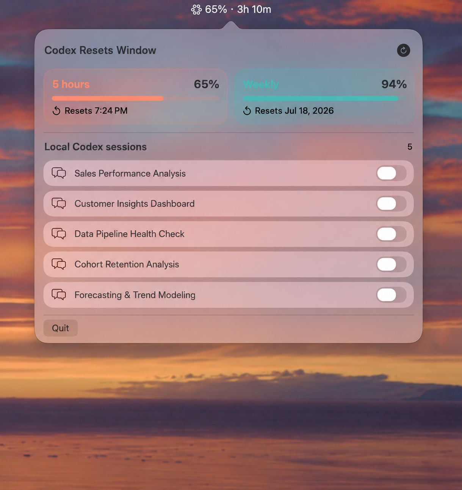

# Codex Resets Window

> A calm, native macOS status-bar companion for Codex usage windows and local session recovery.



## Why it exists

Codex usage is easy to lose track of when the important information is split between a browser usage page, a terminal session, and local conversation history. The result is usually one of three problems:

- You do not know when the 5-hour or weekly allowance becomes available again.
- You forget which local session should continue after the reset.
- You reopen the wrong conversation or manually keep checking the clock.

Codex Resets Window puts the useful state in one small, always-available popover.

## What it does

- Shows the 5-hour and weekly remaining percentages.
- Shows a time for the 5-hour reset and a calendar date for the weekly reset.
- Refreshes usage and the local session list when the popover opens.
- Displays local Codex session titles from `~/.codex/session_index.jsonl`.
- Opens a session when its title area is clicked.
- Lets you enable continuation per session with a compact switch.
- Shows `Start at HH:MM` only while a session switch is enabled.
- Five minutes after the 5-hour reset, sends the English `continue` prompt with `codex exec resume`.
- Uses a lightweight local countdown without network polling.

## Privacy by design

The app reads local Codex metadata and uses the existing login state only for the read-only usage request. It does not commit or upload access tokens, account identifiers, email addresses, or conversation bodies. Session titles stay local and are never copied into project files.

## Build and run

```sh
swift build -c release
swift run CodexResetsWindow
```

The installed app bundle is named **Codex Resets Window.app**. The app prefers the working Codex CLI bundled with ChatGPT.app and falls back to the `codex` command on `PATH`.

## Project notes

- `agent.md` — contribution and privacy guidance.
- `project.md` — architecture, behavior, and development notes.
- `changelog.md` — release history.
